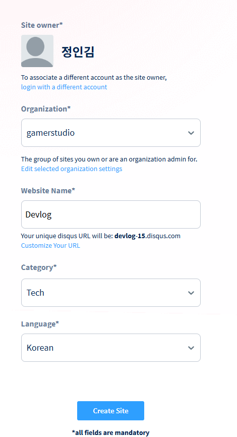
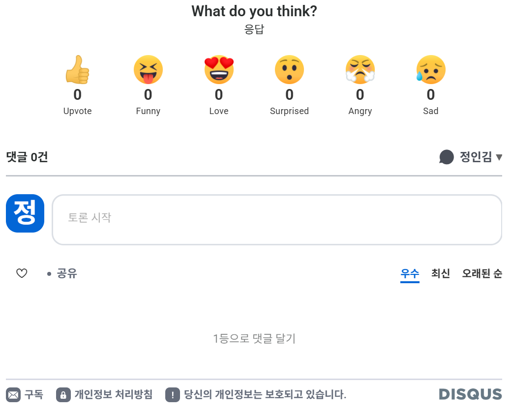

# Subject
* 첫 깃허브 블로그
	첫 깃허브 기반 블로그를 개설하는 김에 독학으로 어느정도 알고있는 기술인 svelte와 Obsidian을 이용해 깃허브를 준비해봤다.

# Task
* 깃허브 블로그 페이지 개설
	[깃허브 문서](https://docs.github.com/ko/pages/quickstart)를 참고하여 내 계정의 페이지 저장소를 개설해줬다.
	
	
	페이지 전용 저장소? 라 그런가 이름 입력부터 범상치않다. 블로그 용도로 사용할 것이기에 gitignore는 설정하지 않고, license도 당연히 설정하지 않았다. 
	
	이후 레포에서 Settings - Pages 설정을 통해 블로그 배포 설정을 해주었다.
	
	일단 배포 분기는 테스트를 위해 따로 변경해주지 않았다.


* 저장소 로컬 복제
	이후 깃허브 데스크탑을 이용해 간편하게 저장소를 내PC로 복제해줬다.
	


* Obsidian 연결
	이후 해당 저장소를 복제한 폴더를 옵시디언으로 열었다.
	


* Obsidian & Git 연동
	연동을 위해 옵시디언에 커뮤니티 플러그인 Git을 설치해줬다. 관련 내용은 [블로그](https://alive-wong.tistory.com/65)를 참조했다.
	
	
	깃허브 데스크톱을 설치해줘서 그런가 Git 플러그인만 설치해줘도 아래와 같이 바로 연동이 되었다.
	


* Disqus를 이용한 댓글 기능 추가
	그래도 블로그인데 댓글이 있어야한다고 생각해 구글링을 통해 찾은 Disqus로 추가해봤다. 깃허브 기능인 Discussions도 [Graphql API](https://docs.github.com/ko/graphql/guides/using-the-graphql-api-for-discussions) 가 있어 이걸 이용하면 어떨까도 했지만 결국 Graphql 은 타입스크립트정도는 있어야 해볼만할 것 같아 나중에 정적 사이트 블로그 구현할 때 해보기로 하고, 일단은 Disqus 무료 플랜을 이용해 [다른 블로그](https://jongsky.tistory.com/26)를 참고하여 간단하게 구현해봤다.
	
	이전에 Disqus에 대해 알아보느라 계정을 만들어뒀던 게 있어 계정 만들기는 스킵하고 Disqus 사이트 우측 상단의 Site admin 패널로 들어간뒤 좌측 상단의 Your Sites - New를 눌러 새로운 사이트를 추가해주었다.
	
	
	이후 내 깃허브 블로그는 Jekyll 기반이라 관리자 패널에서 Installtion - Jekyll의 설정을 복사하고 다시 관리자 패널에서 Website Name를 입력한뒤 General - Shortname를 복사해 댓글 설정을 만들어 저장소 블로그 콘피그에 넣어줬다.
	```yml
	layout: default
	comments: true
	shortname: 'devpotion'
	```
	
	
	


# Review
첫 마크다운 형태의 문서로 만드는 블로그다보니 내용이 많이 부실한 것 같다. 그래도 확실히 옵시디언 자체의 UI가 깔끔하고 좋다보니 블로그를 만드는데 글쓰는 느낌이 너무 좋았다.


# TODO
내일은 svelteKit 연동 준비할겸 C# 1일차 강의나 봐야겠다.


 #팀스파르타 #TIL #devlog #내일배움캠프
