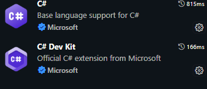
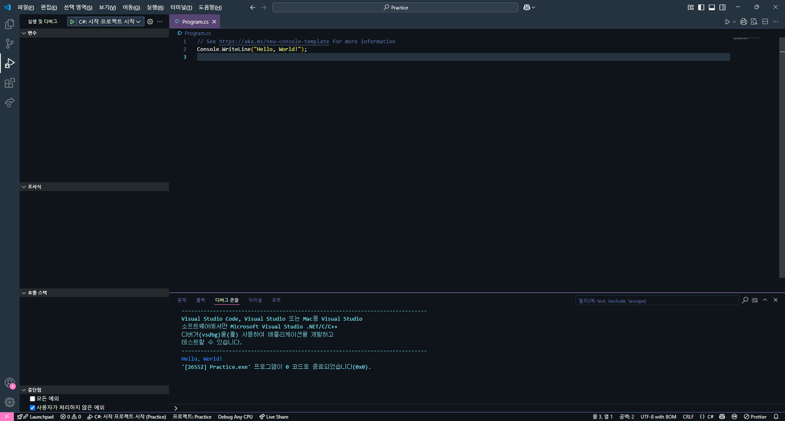
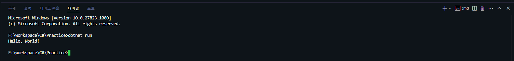
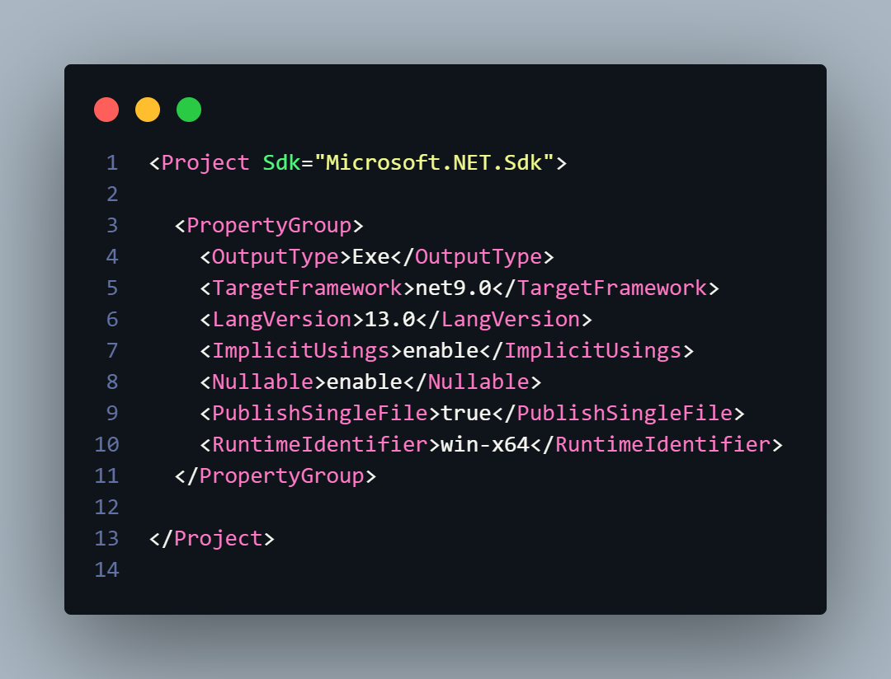

# Subject
* C# 작업환경 만들기
	편집기는 Vscode(UI가 간단하고 비주얼 스튜디오에 비해 가벼워서 빠르다), dotnet cli를 통해 C# 강의를 위한 작업환경을 만들어보았다. 간단히 실습용으로 사용하기 위해 코드 업로드는 깃허브 Gist를 이용했고, 따로 저장소를 파지는 않았다.


# Task
* Dotnet Cli를 이용해 프로젝트 생성
	NetFramework 9.0이 설치된 상태에서 'Practice' 작업용 폴더를 만들고 명령어를 이용해 dotnet 콘솔 프로젝트를 생성했다.
	```batch
	dotnet new console
	```
```plaintext
	F:\workspace\C#\Practice>dotnet new console
	"콘솔 앱" 템플릿이 성공적으로 생성되었습니다.
	
	생성 후 작업 처리 중...
	F:\workspace\C#\Practice\Practice.csproj 복원 중:
	복원에 성공했습니다.
```

* Vscode 연결
	프로젝트 폴더를 Vscode에서 열고 디버깅을 위해 C# 필수 확장을 설치해주었다.
	- 개발환경용 확장 
		
	- dotnet 프레임워크 설치 툴
		
	

* 디버그 테스트
	f5로 초기 프로젝트 설정을 해주니 자동으로 설정이 되고 실행까지 성공적으로 된 모습이다.
	


* cmd 창 빌드테스트
	편집기 디버그도 좋지만 경험상 디버그창에서는 일부 입력이 다르게 작동한다 것을 알고있기에 나는 Ctrl+J로 터미널을 띄운뒤 ```dotnet run```을 통해 한번 더 실행해봤다.
	
	실행이 매우 만족스럽게 되는 모습이다.


* 프로젝트 파일 업데이트
	이왕 cli로 프로젝트를 만든 겸 csproj도 직접 편집해서[^1] 바꿔보았다. 간단하게 C# 버전을 바꾸기 위해 ```LangVersion 13```과 단일 파일로 출력하기 위해```PublishSingleFile true```
, 실행 플랫폼[^2]을 특정하기 위해 ```RuntimeIdentifier win-x64```를 추가했다.
	


# Review
크~ 언제나 기본적으로 제공되는 편집기대신에 cli랑 직접 편집기 커스텀해서 만드는 작업환경은 로망이 있다.


# TODO
내일은 진짜로 1일차 강의 봐야지; 오늘은 유니티가 너무 하고싶다.


#내일배움캠프 #dotnet #csharp #TIL #팀스파르타 #devlog

[^1]: Chatgpt의 도움을 받았다 ㅋㅋ

[^2]: 출력파일에 확장자가 없어서 당황했던 적이 있다,,, 


<script>
    var disqus_config = function () {
    this.page.url ="https://amateurpotion.github.io/AmateurPotion/%EB%82%B4%EC%9D%BC%EB%B0%B0%EC%9B%80%EC%BA%A0%ED%94%84%20TIL/1%EC%A3%BC%EC%B0%A8/20250412%20Dotnet%20Core%20%EA%B0%9C%EB%B0%9C%ED%99%98%EA%B2%BD%20%EB%A7%8C%EB%93%A4%EA%B8%B0";  // Replace PAGE_URL with your page's canonical URL variable
    this.page.identifier = "내배캠_1_2"; // Replace PAGE_IDENTIFIER with your page's unique identifier variable
    };
    (function() { // DON'T EDIT BELOW THIS LINE
    var d = document, s = d.createElement('script');
    s.src = 'https://devpotion.disqus.com/embed.js';
    s.setAttribute('data-timestamp', +new Date());
    (d.head || d.body).appendChild(s);
    })();
</script>
<noscript>Please enable JavaScript to view the <a href="https://disqus.com/?ref_noscript">comments powered by Disqus.</a></noscript>