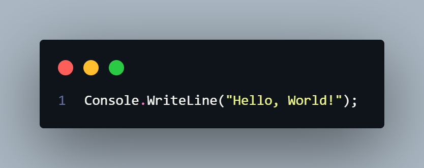

# Subject

대학에서 배웠던 내용이지만 내일배움캠프 C# 문법 종합반 1주차 강의를 복습겸 진행했다...


# Task
* C#이란?
	1. 마이크로소프트에서 개발한 .NET 프레임워크 기반으로 동작하는 객체지향 언어이며, 다양한 플랫폼을 지원한다.
	2. 강력한 형식 시스템과 가비지 컬렉션 기능이 있다.
	3. Java에서 출발한 언어이다.
	4. IL2CPP 같은 추가기능으로 C++로 컴파일이 가능하다.


## 작업환경

	[이전 글](https://amateurpotion.github.io/AmateurPotion/%EB%82%B4%EC%9D%BC%EB%B0%B0%EC%9B%80%EC%BA%A0%ED%94%84%20TIL/1%EC%A3%BC%EC%B0%A8/20250412%20Dotnet%20Core%20%EA%B0%9C%EB%B0%9C%ED%99%98%EA%B2%BD%20%EB%A7%8C%EB%93%A4%EA%B8%B0)에서 Vscode+Dotnet cli기반으로 구축했기 때문에 넘어갔다.


## Hello, World!
	늘 그렇듯 코딩 시작할 때 기본적으로 출력하는 것. 출력해보았다.
	
	
	```
	F :\workspace\C#\Practice>dotnet run
	Hello, World!
	```
	직접 구성했기 때문에 위처럼 간단히 진입점을 따로 구성하지않고 메소드만 호출해도 바로 출력이 되었다.


## Escape Sequence
	요즘 언어가 그렇듯 C#도 이스케이프 시퀀스를 지원하다. 이스케이프 시퀀스, 형식 문자는 문자열을 편집할 때 다른 코드를 추가로 사용하지 않고 간단하게 편집하거나 일반적으로는 넣을 수 없는 문자를 넣는 용도로 사용할 수 있다. 표로 정리해보았다.
	
	| 형식 문자      | 설명             | 형식 문자    | 설명           | 형식 문자    | 설명            |
	| ---------- | -------------- | -------- | ------------ | -------- | ------------- |
	| ``` \` ``` | 작은 따옴표( ` ) 삽입 | ```\\``` | 역슬래시 삽입( \ ) | ```\r``` | 현재 줄 맨 앞으로 이동 |
	| ```\"```   | 큰 따옴표( " ) 삽입  | ```\n``` | 줄바꿈 삽입       | ```\t``` | 탭 삽입          |
	| ```\b```   | 백스페이스 삽입       |          |              |          |               |


## Comments (주석)
코드의 설명이나 개발자간 커뮤니케이션을 위한 메모

* ```//```: 한 줄 주석. 해당 줄 끝까지 주석처리된다.
* ```/* */```: 여러 줄 주석. 시작과 끝을 명시하여 끝까지 주석 처리된다.
<br>
* 주의사항
	1. 주석의 내용은 정확하고 명확해야 한다.
		설명이 명확해야 코드를 이해할 수 있고, 설명이 모호하다면 주석을 안 적느니만 못할 수도 있다.

	2. 주석은 업데이트 되어야 한다.
		코드가 변경되면 주석도 변경되야 한다. 코드가 변경됬는데 주석은 그대로라면 맞지 않는 정보를 제공하여 1번을 침해하기 때문이다.
	
	3. 주석은 필요한 경우에만 사용해야 한다.
		불필요한 주석이 너무 많다면 오히려 코드를 이해하는데 혼동이 올 수 있다.


## Variables & Data Type (변수와 자료형)
여느 언어든 간에 그렇듯이 데이터를 알맞은 자료형에 담아서 저장하면 메모리의 효율적인 사용, 타입의 안전성 보장, 정확한 데이터 표현이 가능하다. C#에서 사용하는 기본적인 자료형을 간단히 표로 정리해 보았다.

| 자료형     | 데이터 타입         | 크기(byte)         | 범위                                                     |
| ------- | -------------- | ---------------- | ------------------------------------------------------ |
| sbyte   | System.Sbyte   | 1                | -128~127                                               |
| byte    | System.Byte    | 1                | 0 ~ 255                                                |
| short   | System.Int16   | 2                | -32,768 ~ 32,767                                       |
| ushort  | System.UInt16  | 2                | 0 ~ 65,535                                             |
| int     | System.Int32   | 4                | -2,147,483,648 ~ 2,147,483,647                         |
| uint    | System.UInt32  | 4                | 0 ~ 4,294,967,295                                      |
| long    | System.Int64   | 8                | -9,223,372,036,854,775,808 ~ 9,223,372,036,854,775,807 |
| ulong   | System.UInt64  | 8                | 0 ~ 18,446,744,073,709,551,615                         |
| float   | System.Single  | 4                | ±1.5 × 10^-45 ~ ±3.4 × 10^38                           |
| double  | System.Double  | 8                | ±5.0 × 10^-324 ~ ±1.7 × 10^308                         |
| decimal | System.Decimal | 16               | ±1.0 × 10^-28 ~ ±7.9 × 10^28                           |
| char    | System.Char    | 2                | 유니코드 문자                                                |
| string  | System.String  | 8~최대 2gb(약 10억자) | 유니코드 문자열                                               |
| bool    | System.Boolean | 1                | true 또는 false                                          |

이상 나머지는 귀찮으므로 스킵ㅋㅋㅋ한ㅋㅋㅋ닼ㅋㅋㅋㅋㅋㅋ
* [문자열 처리](https://learn.microsoft.com/ko-kr/dotnet/csharp/programming-guide/strings/)
* [연산자 문서](https://learn.microsoft.com/ko-kr/dotnet/csharp/language-reference/operators/)
* [이진 연산 문서](https://learn.microsoft.com/ko-kr/dotnet/csharp/language-reference/operators/bitwise-and-shift-operators)
* [논리 연산 문서](https://learn.microsoft.com/ko-kr/dotnet/csharp/language-reference/operators/boolean-logical-operators)
* [개쩌는 암시적 형식 변수 문서](https://learn.microsoft.com/ko-kr/dotnet/csharp/language-reference/statements/declarations)


# Problem


# Review
분명 복습하는 만큼 키워드도 표로 간단하게 싹 정리할 생각이었는데 일요일이라 그런가 너무 귀찮았다.... 나중에 심심할 때 하든 해야지...(절 대 안 함)

# TODO
C# 2일차 할꺼당

#내일배움캠프 #dotnet #csharp #TIL #팀스파르타 #devlog
<br>
<br>
이전글) [Dotnet Core 개발환경 만들기](https://amateurpotion.github.io/AmateurPotion/%EB%82%B4%EC%9D%BC%EB%B0%B0%EC%9B%80%EC%BA%A0%ED%94%84%20TIL/1%EC%A3%BC%EC%B0%A8/20250412%20Dotnet%20Core%20%EA%B0%9C%EB%B0%9C%ED%99%98%EA%B2%BD%20%EB%A7%8C%EB%93%A4%EA%B8%B0)