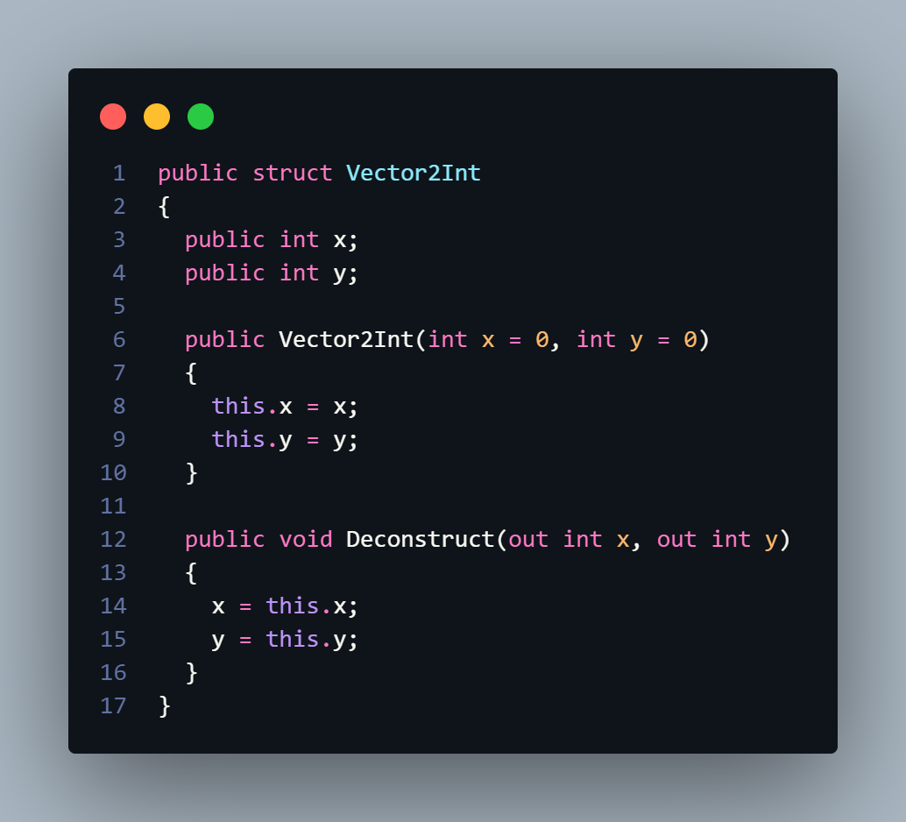

# Subject
내일배움캠프 2주차 과제 C# 콘솔게임으로 오픈월드 소켓통신기반 p2p 멀티플레이 게임 < Starfall >를 만들기로 했다.

* 작업환경 구성
	간단하게 ```dotnet new console```랑 깃허브 데스크탑으로 작업환경을 구성하고 디코 웹훅으로 깃허브 저장소와 연결해줬다.
	이후 csproj 파일에서 언어 버전을 13으로 설정하고 ```PublishSingleFile true``` 과```RuntimeIdentifier win-x64```로 단일파일 출력과 윈도우 플랫폼 설정을 해줬다.

* 폴더 구성
	개발을 시작하기에 앞서 필요한 생각되는 기능들을 기준으로 폴더를 먼저 구성했다.
	* Entities - 타일, 세계의 엔티티등
	* IO - 콘솔, 파일 입출력 등
	* Utils - Vector2Int 와 같은 유틸리티
	* Worlds - 세계 데이터 관리자
	

* 기초 클래스 구성
	* Vector2Int
		C#에서 기본제공하는 Vector2는 float기반이라 간단하게 유니티에 없어서 불편했던 Deconstruct정도만 더해서 구현했다.
		
	* Tile
		월드를 구성할 타일을 구성했다. 기본적으로 보여줄 문자(```char code```)와 색상(```ConsoleColor color, background```), 이동가능여부(```bool movable```)에 편한 변환을 위해서 char 암시적 변환자를 추가해 구현했다.
		
	* Entity
		월드상 엔티티를 구현하기 위한 클래스. 타일과 마찬가지로 임시로 필요한 것들만 간단히 넣어서 구현했다. 이후에 상속 기반으로 자식 클래스 구현하는 것에 중점을 둘 것이기에 추상 클래스가 더 좋을까 싶기도하다. 추가적으로 렌더러 구현에서 편하게 쓰기 위해 형식 분해 메소드를 구현했다.
		
	* World
		타일, 엔티티 등을 담고 관리하기 위한 클래스. 마찬가지로 필요한 변수만 선언해서 간단히 구현했다. ```tileMap```과 ```entityMap```의 경우 메모리 최적화를 위해 넓이, 높이를 따로 선언한 뒤 1차원 배열로 구현했다. 이후에 ```SetTile```등 메소드를 구현할 예정. ```entityMap```은 안이 비어있을 수 있기 때문에 Nullable로 구현했다.
		
	* Renderer
		대망의 월드 렌더러. 잡다한 클래스 선언을 방지하기 위해 튜플 형식 분해를 적극 활용했다. 추가적으로 ```Nullable``` 배열인 ```Entity?[] entityMap```을 안전하게 사용하기 위해 ```is```타입 체크와 형식분해를 이용해 구현했다.
		


# Review


# TODO

#내일배움캠프 #dotnet #csharp #TIL #팀스파르타 #devlog #consoleGame
<br>
<br>
