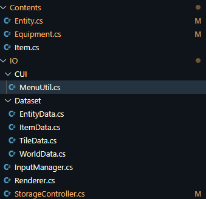

# Subject
내일배움캠프 2주차 콘솔게임 제작 과제 < Starfall > 개발 2일차

* 텍스트 리소스
	일부 설명글의 경우 코드상에 직접 넣는 것보다 텍스트로 작성한 후에 읽어서 출력하는 것이 효율적으로 보여 csproj를 통해 텍스트 파일을 리소스로 추가하고 코드로 불러오게끔 만들었다.(채찍피티는 신이다!)

* 게임 데이터 저장 & 불러오기 구현
	Newtonsoft.json을 사용하지않고 C# 고유의 기능을 사용해 데이터 역/직렬화를 구현해보고 싶어 System.Text.Json를 이용해 구현했다. 먼저 게임이 시작할 때 초기화 메소드를 통해 저장 폴더를 체크하여 폴더에서 예외가 발생하지 않도록 방지했다.
	```C#
	public static void Init()
    {
      static void CreateDir(string path)
      {
        var info = new DirectoryInfo(path);
        if (!info.Exists) info.Create();
      }
  
      CreateDir("saves");
      CreateDir("saves/world");
    }
	```
	이후 게임 데이터를 불러오는 방식은 폴더 목록을 긁어오게 구현했다.
	```C#
		public static string[] GetSaveNames()
	    {
	      return Directory.GetDirectories("./saves/world");
	    }
	```
	게임 데이터 저장은 이후에 월드를 구현하고 그에 맞춰 만들기 위해 메소드만 선언했다.


* 게임 리소스 생성 및 불러오기
	게임 데이터를 좀 더 불러오기 쉽게 만들기 위하여 일부 게임 데이터들을 구조체화시켰다. 이후, JSON 형태로 프로젝트에 포함해서 빌드예정이고, 런타임에 리소스를 통해 불러올 예정이다.
	


# Review


# TODO
월드 구현하고 마무리를 지어보자...

#내일배움캠프 #dotnet #csharp #TIL #팀스파르타 #devlog #consoleGame
