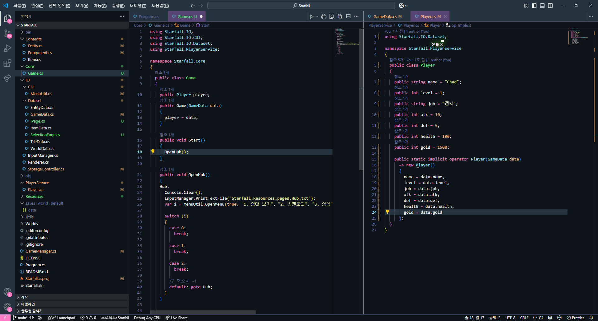
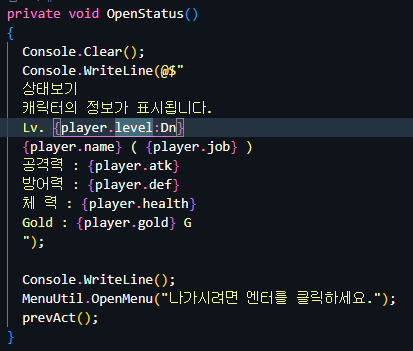
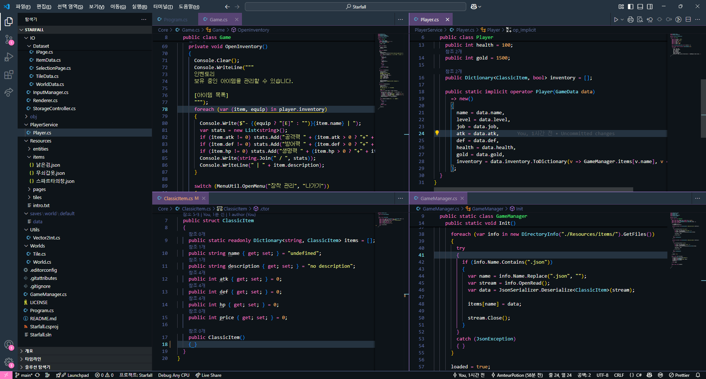

# Subject
* 플레이어 데이터 불러오기를 편하게 하기위해 암시적 변환으로 Implicit을 이용해 구현했다.
	

* 스텟창의 다중 행을 구현하기 위해 @를 이용했다.
	

* 인벤토리 구현
	아이템 구조체를 구현하고, json으로 아이템 구현을 쉽게 만든 다음 GameManager에서 아이템 데이터를 로딩하고, 플레이어 저장 데이터를 불러와서 적용할 수 있게 Linq를 이용해 구현했다.
	

# Review
서브 프로젝트하느라 과제를 제대로 못했다..... 과제 먼저 제대로 챙기도록 하자.

# TODO
과제 끝내고 업로드하자..

#내일배움캠프 #dotnet #csharp #TIL #팀스파르타 #devlog #consoleGame
