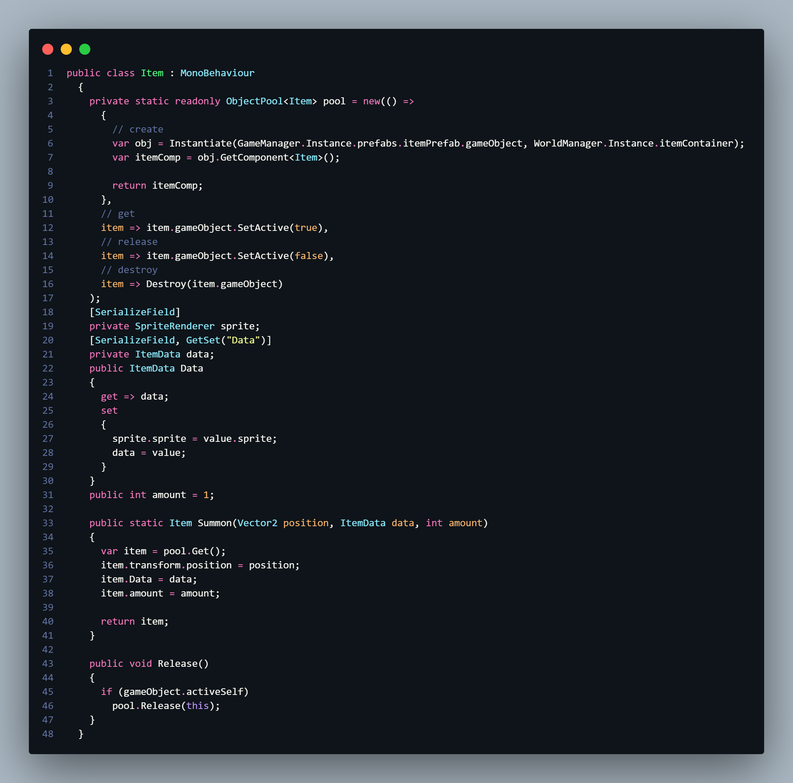

# Subject - 아이템 구현
* ScriptableObject - ItemData.cs
	기초 아이템 오브젝트를 구성하는 데 필요한 변수만 첨부하여 간단하게 구성했다.
	sprite - 아이템 이미지 / mass - 아이템 무게, 이후 아이템 기초 가치로도 활용
	color - 아이템 대표 색상, 아이템 필터 등을 설정하는 용도로 사용하기 위해 설정
	```C#
	public class ItemData : ScriptableObject
	{
	  public Sprite sprite;
	  public int mass = 1;
	  public Color color;
	}
	```

* 컴포넌트 - Item.cs
	GameManager에 원본 프리팹 참조를 만들고 오브젝트풀 기법을 이용해 구현했다. 추가로 렉 방지를 위해 각각 1개로 처리하지 않고 컴포넌트 자체에 개수를 설정할 수 있도록 변수를 추가했다. 이후 아이템 개수에 따라 아이템 크기를 변경하면 직관적이어서 더 좋지 않을까 싶긴하다.
	

# Review


# TODO


#내일배움캠프 #dotnet #csharp #TIL #팀스파르타 #devlog #consoleGame