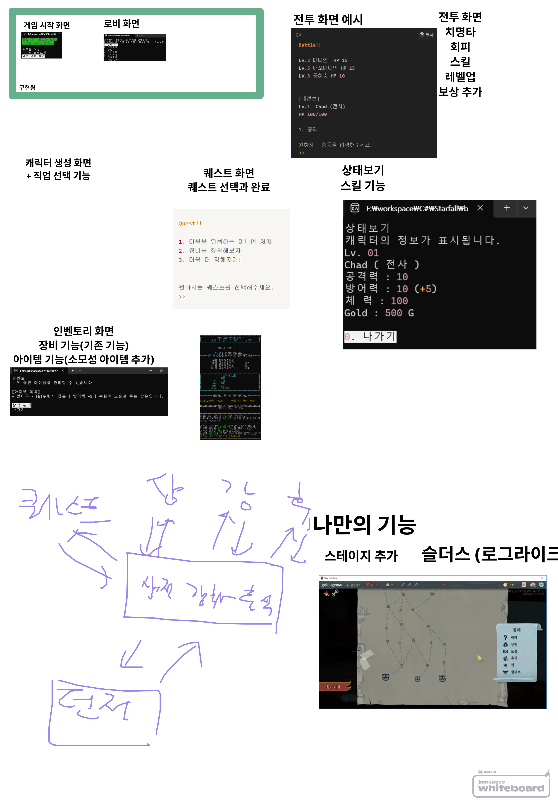

# Subject - 팀 프로젝트 < Starfall >
내일 배움 캠프 3 주차 팀 과제 ConsoleGame 협업 제작 프로젝트 Starfall 입니다. 저번 주차에 했던 개인 과제 Starfall를 팀 저장소로 이전한 뒤 과제 명세를 확인 및 와이어 프레임을 팀원과 회의를 통해 설계한 뒤 프로젝트를 진행했습니다.

팀원 - 양성대 님, 박재현 님, 오태영 님, 최영임 님님

## 오전 - 프로젝트 준비
프로젝트 발제 이후 빠른 진행을 위해 미리 간단하게 준비를 해줬습니다.

* Github 팀 개설 및 저장소 이전
	이전에 개설하여 사용했었던 [GamerStudio organization](https://github.com/Gamer-Studio)에 3주차 프로젝트를 위한 팀(내배캠-2)를 개설한 뒤 개인 저장소에 있던 [Starfall](https://github.com/Gamer-Studio/Starfall) 저장소의 소유권을 이전하고 팀원들을 초대해줬습니다.

* Discord 알림 설정
	깃허브 커밋 알림을 통해 빠르게 진행을 하기 위해 디스코드 채널에 웹훅을 설정한 뒤 깃허브 저장소에 모든 알림 전송으로 연동시켜주었다.

* 와이어프레임 설계
	프로젝트 발제 이후 점심 전까지 자투리 시간 동안 디스코드 화이트보드 기능을 이용해 팀원들과 회의를 하여 와이어프레임을 과제 필수/도전 요구 사항에 맞추어 간단히 설계를 하였다.
	
	위와 같이 기존에 구현했던 기능에 더해 먼저 과제 요구 사항을 글로 적고 예시로 이미지를 가져와 각 기능과 화면을 디자인했다.

## 오후 - 프로젝트 진행
점심식사와 GIT 특강을 진행 후 프로젝트를 간단하게 진행하였다.

* 몬스터 구조체 구현 - 박재현 님
	json으로 몬스터 데이터를 구현한 후 구조체로 편하게 불러와 사용하기 위해 MonsterData 구현을 부탁드렸다.

* 전투 화면 구현 - 오태영 님
	전투 화면 출력 구현을 부탁드렸다.

* 캐릭터 생성 구현 - 최영임 님
	게임 시작시 플레이어 이름, 직업 등을 정할 수 있도록 부탁드렸다.

* 소모성 아이템 구현
	인벤토리에 다른 형태(소모성 등)의 아이템을 저장하고 사용할 수 있도록 직전 개선을 하였다.

* 분기 병합 및 피드백
	이후 각 작업 분기 병합을 진행하였고, 팀 프로젝트 1일차인만큼 서로 협업하는 것에 문제는 없는지 QNA 피드백을 중심으로 진행하였다.

# Review
캠프 중 2번째 진행하는 팀 프로젝트여서 그런지 확실히 진행이 매끄러워진 게 느껴졌다!

# TODO
1. 몬스터 데이터와 전투, 허브 화면 연동
2. 스테이지 추가
3. 전투 보상 구현

#내일배움캠프 #dotnet #csharp #TIL #팀스파르타 #devlog #consoleGame