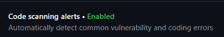
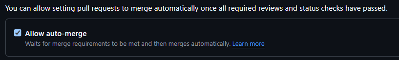
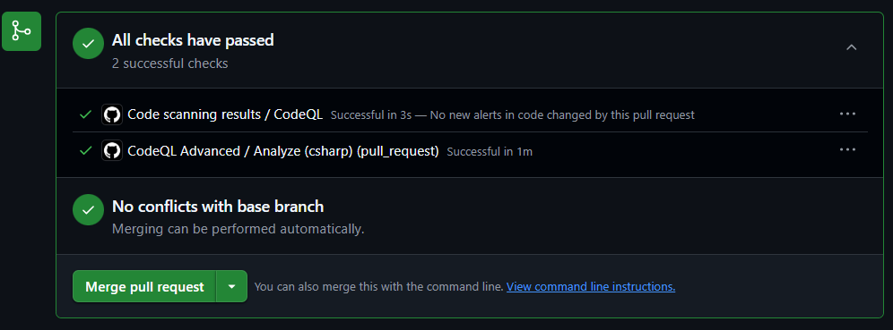

# Subject - 팀 프로젝트 < Starfall >
내일배움캠프 3주차 과제 ConsoleGame 프로젝트 Starfall 2일차를 진행하였습니다.

* Code Scanner
	변경사항을 커밋했을 때 자동으로 컴파일하고 문제가 있는지 확인하도록 Github - Security - Code scanning alerts로 저장소에 워크플로를 설정해주었다.
	
	

 

* Auto merge
	작업량을 조금이라도 줄이기 위해 문제가 없으면 자동으로 머지가 되도록 설정해주었다. (물론 여전히 컨플릭트가 나거나 직접 분기 병합을 할 때는 내가 해야 된다...)
	
	
	워크플로가 컴파일 체크를 수행하고 문제가 없으면 아래와 같이 뜨고 팀원이 만든 리퀘스트의 경우 오토 머지를 설정할 수 있게 된다.(아래는 내가 만든 리퀘스트라 오토 머지가 뜨지 않았다.)
	

 

* 프로젝트
	역할 배분을 통해 퀘스트, 스킬, 전투, 던전 등의 구현을 진행하였고 이후 분기 병합으로 각 분기를 병합하여 정리를 진행해주었다.

# Review
피.곤.타

# TODO
던전! 퀘스트! 모험!

#내일배움캠프 #dotnet #csharp #TIL #팀스파르타 #devlog #consoleGame