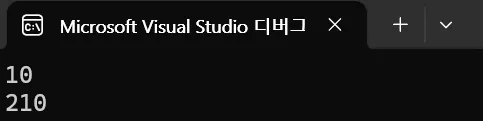
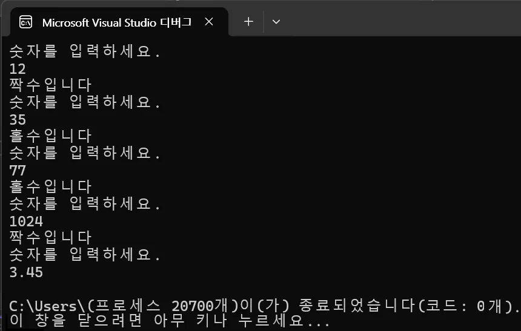
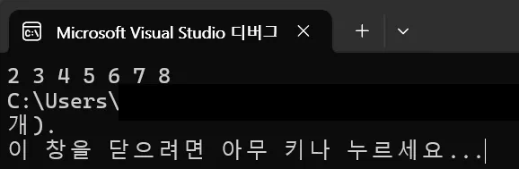
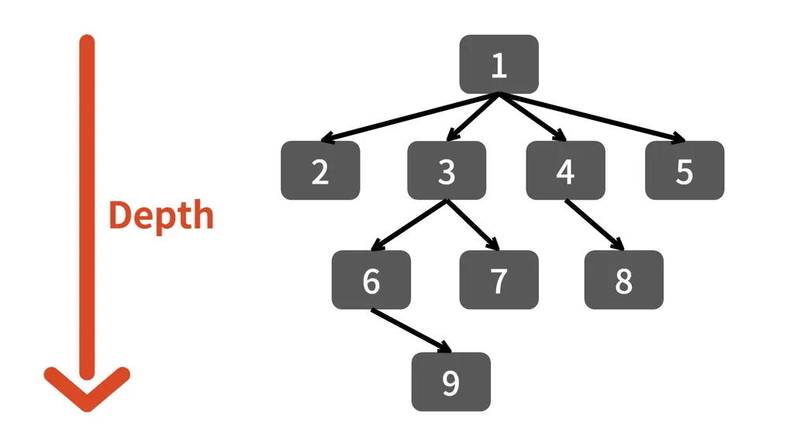

# Subject 1
정수형 배열을 입력받아 배열의 모든 요소의 합을 출력하는 함수를 완성해주세요.
```C#
class Program
{
	static int Sum(int[] arr)
    {
        // TODO : 배열의 모든 요소의 합을 계산하는 코드 작성
        int result = 0;
	    foreach (var i in arr)
	    {
		    result += i;
	    }
	    return result;
        //////////////////////////////////////////
    }

    static void Main(string[] args)
    {
        int[] ints = { 3, 6, 7, 9 };
        Console.WriteLine(Sum(ints));
    }
}
```


# Subject 2
다음 결과를 출력하도록 아래 밑줄 친 곳들의 코드를 완성하시오.


```C#
class Program
{
    private static void Add(int i, ref int result)
    {
        result += i;
    }

    static void Main(string[] args)
    {
        int total = 10;
        Console.WriteLine(total);
        Add(200, ref total);
        Console.WriteLine(total);
    }
}
```


# Subject 3
다음 코드에서는 오류가 발생합니다. 잘못된 것은 무엇인지 설명해보시오.
```C#
class Square
{
    float width;
    float height;

    float Area() { return width * height; }
}

class Program
{
    static void Main(string[] args)
    {
        Square box = new Square();
        Console.WriteLine(box.Area());
    }
}
```
=> ```Square``` 클래스 ```float Area()```메소드의 접근제한자가 ```public```으로 명시적으로 선언되어있지 않아 ```private```로 암시적으로 선언되어 외부에서 일반적인 방법으로는(리플렉션 제외) ```Squre``` 클래스의 ```float Area()```메서드를 호출할 수 없습니다.


# Subject 4
다음 코드의 출력 결과를 작성하고, x의 값이 순서대로 어떻게 변화하는지 작성해주세요. 
```C#
class Program
{
    static void Main(string[] args)
    {
	    // 2
        int x = 2;
        // 3
        int y = 3;
        
        // 2 * (y = 3 + 1) => 2 + 8
        x += x * ++y;
        
        // 10 출력 후 x = 11
        Console.WriteLine(x++);
    }
}
```

* 출력
	```planetext
	10
	```


# Subject 5
계속해서 정수를 입력받아 홀수인지 짝수인지 구분해주는 프로그램을 작성해보세요. 정수가 아닌 데이터를 입력받으면 프로그램이 종료되도록 만들어보세요.


```C#
class Program
{
    static void Main(string[] args)
    {
        while (true)
        {
            Console.WriteLine("숫자를 입력하세요.");
            string answer = Console.ReadLine();

            bool isSuccess = int.TryParse(answer, out int result);

            // TODO : 입력받은 정수가 홀수인지 짝수인지 구분하는 코드 작성하기
            if (isSuccess)
                Console.WriteLine("입력한 숫자가 " + (result % 2 == 0 ? "짝수" : "홀수") + "입니다.");
            else
                Console.WriteLine($"{int.MinValue} ~ {int.MaxValue} 내의 정수를 입력해주세요.");
            ///////////////////////////////////////////////////
        }
    }
}
```


# Subject 6
다음의 코드가 아래의 결과를 출력할 수 있도록 밑줄 부분을 채워 코드를 완성해주세요.


```C#
class Program
{
    static void Main(string[] args)
    {
        int[] intArr = { 4, 7, 2, 5, 6, 8, 3 };

        intArr = [..
            from num in intArr
            orderby num
            select num
        ];

        foreach(int i in intArr)
            Console.Write(i + " ");
    }
}
```


# Subject 7
다음 코드의 출력 결과를 작성하고, 왜 그렇게 되는지 이유를 설명해주세요.
```C#
class Program
{
    public class Unit
    {
        public virtual void Move()
        {
            Console.WriteLine("두발로 걷기");
        }

        public void Attack()
        {
            Console.WriteLine("Unit 공격");
        }
    }

    public class Marine : Unit
    {

    }

    public class Zergling : Unit
    {
        public override void Move()
        {
            Console.WriteLine("네발로 걷기");
        }
    }

    static void Main(string[] args)
    {
        Zergling zerg = new Zergling();
        zerg.Move();
    }
}
```

* 프로그램 진행 순서
	Main(진입점) => zerg = new Zergling() => zerg.Move()

* 설명
	Zergling 클래스의 void Move() 메소드는 부모 클래스 Unit의 Move()메소드를 오버라이드했고, 따로 base.Move()등을 통해 부모 함수를 호출하지 않았기 때문입니다.


# Subject 8
그림과 같은 트리가 있습니다.
이 트리를 깊이우선탐색(DFS, Depth-First Search)으로 검색했을 때의 방문하는 순서와 너비우선탐색(BFS, Breadth-First Search)으로 검색했을 때 방문하는 순서를 적어주세요.


* DFS (깊이우선탐색)
	- 1 - 2 - 1 - 3 - 6 - 9 - 6 - 3 - 7 - 3 - 1 - 4 - 8 - 4 - 1 - 5

* BFS (너비우선탐색)
	* 1 - 2 - 3 - 4 - 5 - 6 - 7 - 8 - 9


# Subject 9
다음 코드의 출력 결과를 작성하고, 왜 그렇게 되는지 이유를 설명해주세요.
```C#
class Program
{
    static void Main(string[] args)
    {
        Stack<int> stack = new Stack<int>();

        stack.Push(1); // [1]
        stack.Push(2); // [2, 1]
        stack.Push(3); // [3, 2, 1]
        stack.Pop(); // [2, 1]
        Console.WriteLine(stack.Pop()); // [1], 2 출력
        stack.Push(4); // [4, 1]
        stack.Push(5); // [5, 4, 1]

        while (stack.Count > 0)
            Console.WriteLine(stack.Pop()); // [] stack 순서대로 모두 출력
    }
}
```

* 출력
	```planetext
	2
	5
	4
	1
	```


# Subject 10
유저의 숫자 입력을 받아오고 이것을 오름차순으로 정렬시키는 알고리즘을 직접 구현하세요. 
(기본 제공 함수(닷넷 API) 사용 금지) ~~<< 우우><~~
```C#
var inputs = new List<int>();
Input:
Console.Clear();
Console.WriteLine("숫자를 입력하거나 엔터를 입력하여 정렬을 시작하세요.");
Console.WriteLine($"입력한 숫자 목록 : {string.Join(", ", inputs)}");

switch (Console.ReadLine())
{
    case var input when int.TryParse(input, out var num):
        inputs.Add(num);
        goto Input;

    case "":
        break;

    default:
        Console.WriteLine("숫자를 입력해주세요.");
        Console.ReadKey();
        goto Input;

}

var sortedArray = new int[inputs.Count];

for (int i = 0; i < sortedArray.Length; i++)
{
    sortedArray[i] = int.MinValue;
}

foreach (var num in inputs)
{
    for (int i = 0; i < sortedArray.Length; i++)
    {
        if (sortedArray[i] == int.MinValue) sortedArray[i] = num;
        else if (num <= sortedArray[i])
        {
            // 작거나 같다면 밀고 넣기
            Push(sortedArray, i, num);
            break;
        }
    }
}

void Push(int[] array, int index, int num)
{
    // MinValue 아니면 밀기
    int length = array.Length, count = 0;
    while (count < length && array[count] != int.MinValue)
        count++;

    for (int i = count; i > index; i--)
    {
        if (array[i - 1] != int.MinValue)
            array[i] = array[i - 1];
    }

    // 삽입
    array[index] = num;
}

Console.WriteLine($"정렬된 목록 : {string.Join(", ", sortedArray)}");
```